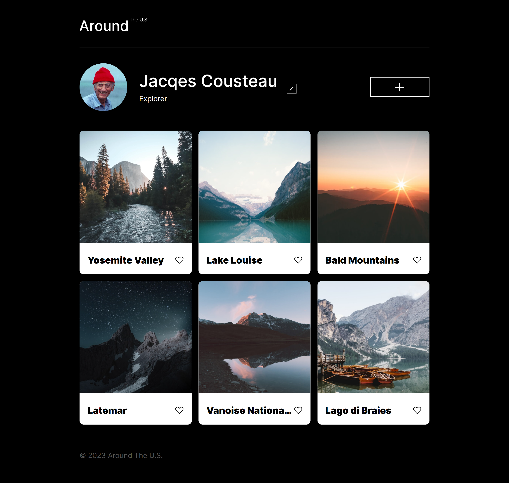
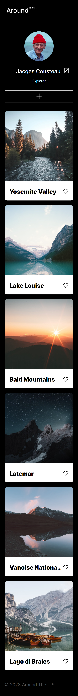

# Project 3: Around the U.S.

## Table of contents

- [Overview](#overview)
  - [Project Features](#project-features)
  - [Screenshot](#screenshot)
  - [Links](#links)
- [My process](#my-process)
  - [Built with](#built-with)
  - [Description](#description)
  - [What I learned](#what-i-learned)
  - [Useful resources](#useful-resources)
- [Author](#author)

## Overview

### Project Features

- Create a responsive website from scratch based on a mockup created using Figma
- Follow a BEM Flat
- Webpage should scale smoothly
- Be able to View the optimal layout for the interface depending on the device's screen size rendering the page
- Use the developer tools to help debug and facilitate the site's responsiveness
- Use CSS Grids and Flexbox to ensure proper and effective responsive behavior
- optimize any and all media used to minimize loading times and increase efficiency

### Screenshot

### Links

- [Github Repo](https://github.com/ialbertmartinez/se_project_aroundtheus/)
- [Live Site URL:](https://ialbertmartinez.github.io/se_project_aroundtheus/)

## My Process

### Built with

- Semantic HTML5 markup
- HTML Templates
- CSS Responsive Grid
- JS: Objects, functions, Arrow functions
- Flexbox
- Media Queries
- Figma Design Brief
- Chrome Dev Tools
- [TinyPNG](https://tinypng.com/)
- [SVGOMG](https://jakearchibald.github.io/svgomg/)
- Embedded the [Inter typeface](https://rsms.me/inter/)

### Requirements:

- Responsive
- Semantic markup
- Use B.E.M. flat file structure
- At least 2 breakpoints:
  - Desktop: 1280px - max width
  - Mobile: 320px - min width
- End result was to match the Figma design comp
- Impliment a 3 col CSS Grid to display the card gallery
- Render the card gallery dynamically using HTML Templates
- add 'like' and 'delete' actions for cards
- add buttons to open/close modals
- add CSS animations to display smooth transitions for modal transitions
- using forms to create cards/update profile
- Responsive with smooth transitions between all breakpoints (no scrollbars at any viewport size)
- 0 errors logged to the console

### Descriotion

This project is a seemingly simple profile page that allows a user to display items as a gallery of custom cards. The user is able to create, update. and delete items in their card gallery as well as update their profile info.

#### Add Custom Cards

In order to add new custom cards to the card gallery, simply tap/click the 'add button' to the far right of the user's name--indicated by the big '+' symbol. For users with screen readers, you will be able to find it using or hearing the aria-label: "add". Newest cards will be placed at the beginning of the gallery.

#### Update

Tap/cick the pencil icon next to the user's name tp edit their name and/or title.

#### Delete

Tap/click on the trashcan icon in the upper-right corder of any card to remove it from the gallery. No confirmation will be given. In a future update, I plan to add this feature in the form of an alert to ensure that is the action you want to take.

#### Like

Tap/click on the heart next to the item's name to 'like' it. In a future update, I plan to make this feature that will stay after you leave the page and come back to it. Currently a WIP.

I will add more as more comes in. I hope you enjoy the project as much as I did building it.

Happy coding everyone,

- A

### Useful resources

- [TripleTen](https://tripleten.com) the best place to optimize your knowledge (especially code)
- [Figma](https://www.figma.com/) A way for design and code, your team and you can work in sweet harmony
- [TinyPNG](https://tinypng.com/)reduce your project's load time by reducing image sizes
- [SVGOMG](https://jakearchibald.github.io/svgomg/) Get rid of the SVG-fluff
- [Inter typeface](https://rsms.me/inter/) A versatile and friendly typeface

## Author

- Github - [Albert Martinez](https://github.com/ialbertmartinez)
- Frontend Mentor - [@ialbertmartinez](https://www.frontendmentor.io/profile/ialbertmartinez)
- Twitter - [@iAlbertM](https://www.twitter.com/ialbertm)
