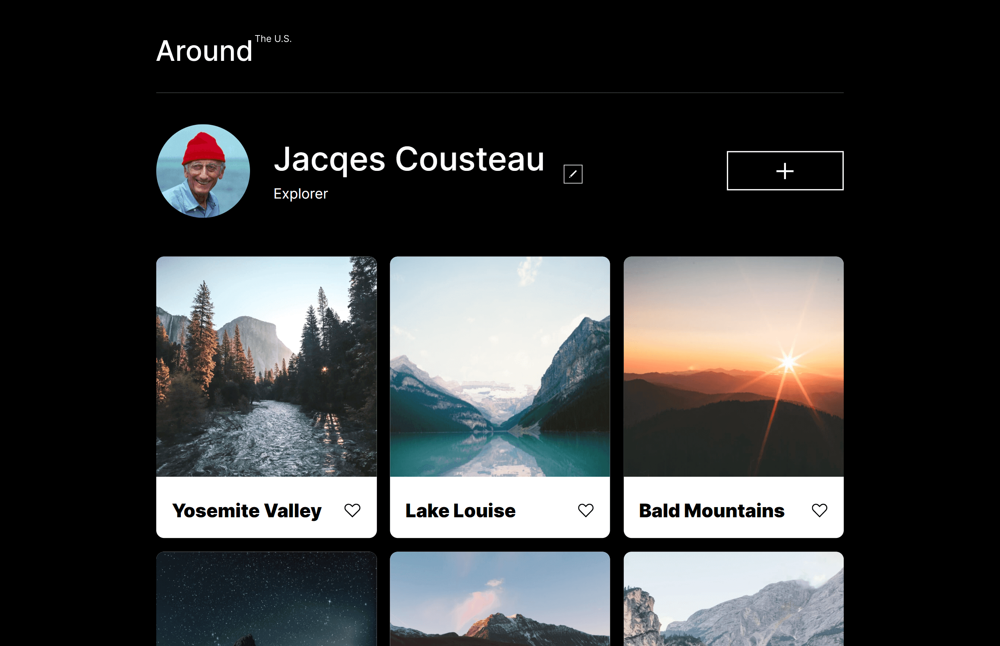

## Table of contents

- [Overview](#overview)
  - [Project Features](#project-features)
  - [Screenshot](#screenshot)
  - [Links](#links)
- [My process](#my-process)
  - [Built with](#built-with)
  - [What I learned](#what-i-learned)
  - [Useful resources](#useful-resources)
- [Author](#author)

## Overview

### Project Features

- Create a responsive website from scratch based on a mockup created using Figma
- Follow a BEM Flat
- Webpage should scale smoothly
- Be able to View the optimal layout for the interface depending on the device's screen size rendering the page
- Use the developer tools to help debug and facilitate the site's responsiveness
- Use CSS Grids and Flexbox to ensure proper and effective responsive behavior
- optimize any and all media used to minimize loading times and increase efficiency

### Screenshot

### Links

- Solution URL: [Add solution URL here](https://your-solution-url.com)
- Live Site URL: [Add live site URL here](https://your-live-site-url.com)

## My Process

### Built with

- Semantic HTML5 markup
- CSS Responsive Grid
- Flexbox
- Media Queries
- Figma Design Brief
- Chrome Dev Tools
- [TinyPNG](https://tinypng.com/)
- [SVGOMG](https://jakearchibald.github.io/svgomg/)
- Embedded the [Inter typeface](https://rsms.me/inter/)

### What I learned

Within a short time, I realized I can whip out several layouts using a few lines of code. Learning how to layout a design using a grid a lot more comfortably and without any fear of breaking something. It's a great feeling.

Being able to use git and github has been a gigantic help. I had used it before but this time I got a more thorough understanding with the help of the Software Engineering Program at [TripleTen](https://tripleten.com)

My biggest and favorite lesson I will continue to thank them for is introducing me too BEM Methodologies. Life is far more easy to digest and understand with [BEM](https://getbem.com/). Cheesy as it sounds, it's very true.

### Useful resources

-[TripleTen](https://tripleten.com) the best place to optimize your knowledge (especially code)

- [Figma](https://www.figma.com/) A way for design and code, your team and you can work in sweet harmony
- [TinyPNG](https://tinypng.com/)reduce your project's load time by reducing image sizes
- [SVGOMG](https://jakearchibald.github.io/svgomg/) Get rid of the SVG-fluff
- [Inter typeface](https://rsms.me/inter/) A versatile and friendly typeface

## Author

- Github - [Albert Martinez](https://github.com/ialbertmartinez)
- Frontend Mentor - [@ialbertmartinez](https://www.frontendmentor.io/profile/ialbertmartinez)
- Twitter - [@iAlbertM](https://www.twitter.com/ialbertm)
