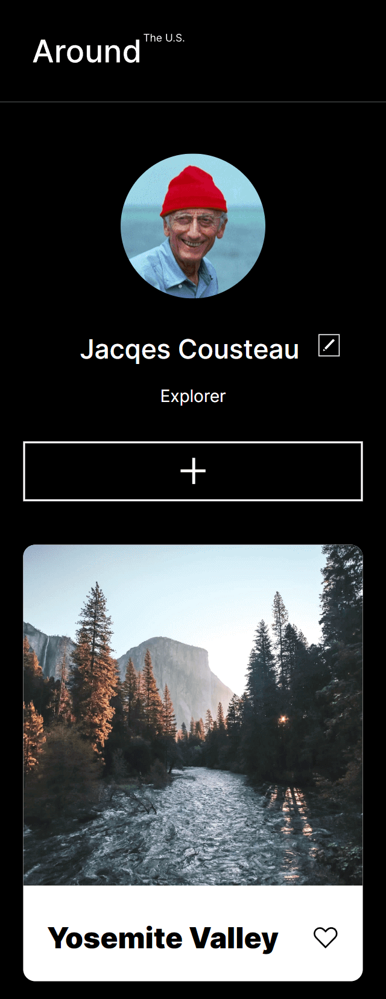

# Project 3: Around the U.S.

## Table of contents

- [Overview](#overview)
  - [Project Features](#project-features)
  - [Screenshot](#screenshot)
  - [Links](#links)
- [My process](#my-process)
  - [Built with](#built-with)
  - [What I learned](#what-i-learned)
  - [Useful resources](#useful-resources)
- [Author](#author)

## Overview

### Project Features

- Create a responsive website from scratch based on a mockup created using Figma
- Follow a BEM Flat
- Webpage should scale smoothly
- Be able to View the optimal layout for the interface depending on the device's screen size rendering the page
- Use the developer tools to help debug and facilitate the site's responsiveness
- Use CSS Grids and Flexbox to ensure proper and effective responsive behavior
- optimize any and all media used to minimize loading times and increase efficiency

### Screenshot




### Links

- Solution URL: [Github Repo](https://github.com/ialbertmartinez/se_project_aroundtheu)
- Live Site URL: [https://ialbertmartinez.github.io/se_project_aroundtheus/](https://ialbertmartinez.github.io/se_project_aroundtheus/)

## My Process

### Built with

- Semantic HTML5 markup
- CSS Responsive Grid
- Flexbox
- Media Queries
- Figma Design Brief
- Chrome Dev Tools
- [TinyPNG](https://tinypng.com/)
- [SVGOMG](https://jakearchibald.github.io/svgomg/)
- Embedded the [Inter typeface](https://rsms.me/inter/)

### What I learned

One of the main hurdles I faced was the gallery. Originally went with flex box but challenged myself to use css grids.

#### A few of the requirements:

- Responsive
- At least 2 breakpoints:
  - Desktop: 1280px - max width
  - Mobile: 320px - min width
- End result was to match the design comp found in Figma (provided)

#### Version 1 - Issues:

- Breakpoints could be a lot smoother and less rigid
- Too few breakpoints left the layout looking awkward at times

#### Version 2 - Plan:

- Convert existing flexbox gallery

to a responsive css grid gallery

- Introduce new breakpoints at the project's tight spots to allow the content to flow and feel smooth

#### Version 2 - Highlights

```css
/* DESKTOP BREAKPOINT 1280PX - 3 col grid */
.content__cards {
  display: grid;
  grid-template-columns: repeat(3, max-content);
  gap: 17px;
}

/* TABLET BREAKPOINT - 2 col grid */
@media screen and (max-width: 880px) {
  .content__cards {
    margin: 0;
    padding: 0;
    grid-template-columns: repeat(2, max-content);
    grid-template-rows: repeat(3, 2fr);
    gap: 20px;
  }
}

/* MOBILE BREAKPOINT */
@media screen and (max-width: 580px) {
  .content {
    min-width: 282px;
    margin: 0 19px 48px;
  }

  .content__cards {
    grid-template-columns: repeat(1, max-content);
    grid-template-rows: repeat(auto-fit, 2fr);
  }
}
```

Being able to use git and github has been a gigantic help. I had used it before but this time I got a more thorough understanding with the help of the Software Engineering Program at [TripleTen](https://tripleten.com)

My biggest and favorite lesson I will continue to thank them for is introducing me too BEM Methodologies. Life is far more easy to digest and understand with [BEM](https://getbem.com/). Cheesy as it sounds, it's very true.

### Useful resources

-[TripleTen](https://tripleten.com) the best place to optimize your knowledge (especially code)

- [Figma](https://www.figma.com/) A way for design and code, your team and you can work in sweet harmony
- [TinyPNG](https://tinypng.com/)reduce your project's load time by reducing image sizes
- [SVGOMG](https://jakearchibald.github.io/svgomg/) Get rid of the SVG-fluff
- [Inter typeface](https://rsms.me/inter/) A versatile and friendly typeface

## Author

- Github - [Albert Martinez](https://github.com/ialbertmartinez)
- Frontend Mentor - [@ialbertmartinez](https://www.frontendmentor.io/profile/ialbertmartinez)
- Twitter - [@iAlbertM](https://www.twitter.com/ialbertm)
